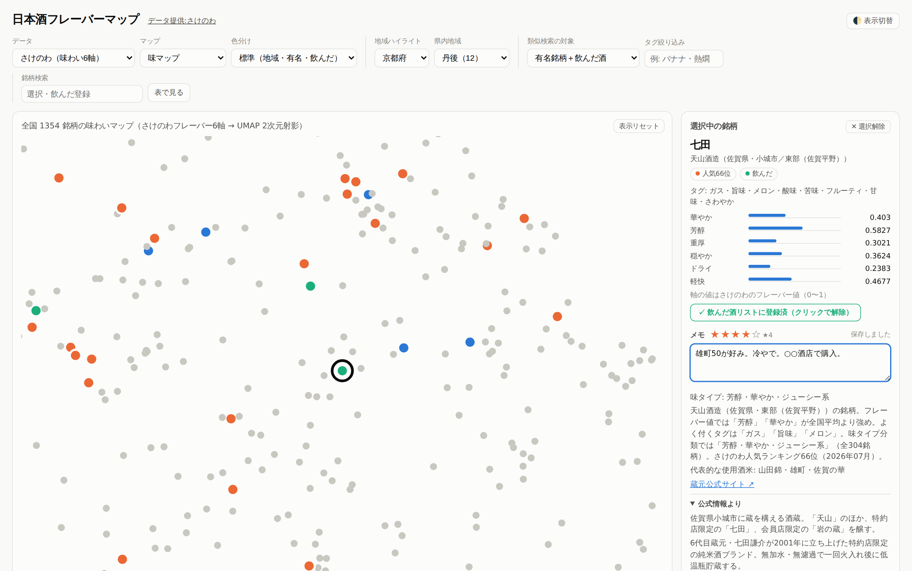

# 日本酒フレーバーマップ

全国の日本酒 1,354 銘柄を「味の傾向」で 2 次元マップに配置し、**選んだ 1 本に味が近い銘柄を探せる**単一 HTML のアプリです。飲んだ酒の記録、♡／♥による好み指定、★評価とメモ、蔵元公式サイト由来の商品リストと価格も入っています。

**▶ アプリを開く: https://latterl.github.io/sake-flavor-map/**



---

## 何ができるか

| | |
|---|---|
| **味で探す** | 味の近い銘柄が地図上で近くに配置されます。1 本選ぶと、味が近い順に 10 銘柄を提示します |
| **地域で探す** | 47 都道府県 → 県内地域（丹後・伏見・灘五郷など 530 市区町村を分類）の 2 段階でハイライト |
| **飲んだ酒を記録** | 飲んだ銘柄を一覧で管理し、♡を♥にして好みを指定すると「好みの中心」に近い**まだ飲んでいない**銘柄を探せます |
| **未踏度で探す** | 飲んだ酒からの距離を濃淡で表示し、「未体験ゾーン」とその代表銘柄を提案します |
| **メモを残す** | 銘柄ごとに★1〜5 の評価と自由記述メモ。ブラウザに自動保存され、「メモあり」一覧やマップのホバー表示から見返せます |
| **商品を見る** | 1,054 銘柄に蔵元公式サイト由来の商品リスト（上流重複を除く 4,959 商品・公式価格 3,091 件、全件に出典 URL） |
| **タグで絞る** | 「バナナ」「熱燗」などのフレーバータグで最大 3 個の AND 絞り込み |

## こんな時に便利

- **酒屋でどれを買うか迷ったとき** — 好きな銘柄を選び、「近い銘柄」から似た味のお酒を探せます
- **いつもと少し違う酒を試したいとき** — 「未踏度」で、まだ飲んでいない味わいの方向を見つけられます
- **自分の好みを言葉にしにくいとき** — 好きな銘柄を♥にして「好みの中心」を見ると、共通する味の傾向が分かります
- **旅行先や出張先で地酒を探すとき** — 都道府県・県内地域や蔵マップから、現地の銘柄を探せます
- **飲み比べの候補を選ぶとき** — 似た銘柄を揃えたり、あえて離れた味の銘柄を選んだりできます
- **飲んだ酒を忘れたくないとき** — ★評価とメモで、味の印象、飲んだ店、料理との相性などを記録できます
- **好きだった酒をもう一度探したいとき** — 「好み優先」「評価順」や「メモあり」一覧から振り返れます
- **プレゼントを選ぶとき** — 相手が好きな銘柄を起点に、味の近い別銘柄を候補にできます
- **日本酒に詳しくない人へ説明するとき** — 味マップや味わい6軸を使って、「華やか」「軽快」などの特徴を視覚的に比較できます
- **商品や価格を調べたいとき** — 銘柄の詳細から、蔵元公式の商品情報や出典を確認できます

使い方の詳細は **[docs/USAGE.md](docs/USAGE.md)** を参照してください。

## すぐ使う

サーバーは不要です。次のいずれかで動きます。

1. 上のリンク（GitHub Pages）をブラウザで開く
2. `app/sake_map.html` をダウンロードしてダブルクリック

ネットワーク接続なしでも動作します（外部 CDN やフォントを一切読み込みません）。対応ブラウザは Chrome / Edge / Firefox / Safari の最新版です。

## データの中身

### パターン1: さけのわデータ（銘柄単位・味わい6軸）

ユーザーのチェックインから算出された **フレーバー6軸**（華やか・芳醇・重厚・穏やか・ドライ・軽快）を使います。全 3,267 銘柄のうちフレーバーデータのある **1,354 銘柄**を収録（2026-08-14 取得）。「有名銘柄」はさけのわ人気ランキング Top100（2026年7月版）です。

### パターン2: スペックデータ（商品単位・5軸）

日本酒度・酸度・アミノ酸度・アルコール度数・精米歩合の **5 軸**。1,294 商品中 **1,234 商品**を収録（2020年時点）。同一銘柄内の「純米大吟醸と本醸造」を区別できるのが利点です。

アプリ上部の「データ」切替でどちらのデータセットも見られます。

## 手法

1. 特徴量を z-score 標準化
2. **UMAP**（n_neighbors=15, min_dist=0.15, seed=42）で 2 次元に射影 → マップ座標
3. 類似銘柄は **射影前の標準化特徴量空間でのユークリッド距離**で計算（2 次元射影は歪みを含むため、近傍計算にマップ座標は使いません）
4. 味タイプは k-means（さけのわ 7 分類・スペック 6 分類、seed=42）。タイプ名は各クラスタで相対的に強い味軸と特徴的タグから機械的に命名
5. 参照用に PCA も実施（寄与率: さけのわ6軸 PC1=49.3%・PC2=25.8%、スペック5軸 PC1=44.0%・PC2=25.1%）

検証済み: アプリ(JS)と Python で近傍計算結果が一致すること、z 値が生値からの再計算と一致すること、生値が API 原データと一致すること、各件数の整合。

## リポジトリ構成

```
app/
  sake_map.html        ← 配布物。これ 1 ファイルで動く（約 5 MB）
  template.html        ← アプリのソース（HTML+CSS+JS）
  build_app.py         ← template にデータを埋め込んで sake_map.html を生成
  data_sakenowa.json   ← パターン1のアプリ用データ
  data_specs.json      ← パターン2のアプリ用データ
analysis/              ← データ構築スクリプトと特徴量CSV、静的図
data/
  sakenowa/            ← さけのわAPIの生データ
  brewery_urls.json    ← 蔵元公式サイトURL（Code for SAKE 由来の派生ファイル）
  details/             ← 蔵元公式サイト由来の商品・価格（都道府県別、全件出典URL付き）
  region_schemes.json  ← 県内地域の定義（530市区町村）
  brewery_locations.json ← 蔵元→市区町村（出典付き）
docs/                  ← 使い方・開発手順・出典一覧
scripts/               ← データ取得スクリプト
THIRD_PARTY_NOTICES.txt ← 第三者ライセンス全文と表示義務
```

## 再ビルド

```bash
pip install numpy pandas scikit-learn umap-learn matplotlib shapely
bash scripts/fetch_sakenowa.sh        # さけのわAPIから最新データ取得
python3 analysis/build_sakenowa_dataset.py
python3 analysis/build_specs_dataset.py
python3 analysis/build_enrich.py      # 位置・地域・商品情報の付与
python3 app/build_app.py              # → app/sake_map.html
```

見た目や機能だけを変える場合は `app/template.html` を編集して `python3 app/build_app.py` を実行するだけです。詳しくは **[docs/DEVELOPMENT.md](docs/DEVELOPMENT.md)**。

## 出典とライセンス

**コード**は MIT License（[LICENSE](LICENSE)）。**データは提供元それぞれの条件**に従います。第三者ライセンスの全文と表示義務は **[THIRD_PARTY_NOTICES.txt](THIRD_PARTY_NOTICES.txt)**、出典の詳細は **[docs/DATA_SOURCES.md](docs/DATA_SOURCES.md)** にまとめています。

主な出典:

- **データ提供: [さけのわ](https://sakenowa.com)**（[さけのわデータプロジェクト](https://muro.sakenowa.com/sakenowa-data/)）— フレーバー6軸・銘柄・蔵元・人気ランキング・タグ
- [sake_dataset](https://github.com/yoichi1484/sake_dataset)（MIT）— スペックデータ（日本酒度・酸度など）
- [Code for SAKE 酒蔵オープンデータ](https://github.com/Code-for-SAKE/SAKEOpenData)（MIT）— 蔵元住所・公式サイトURL
- [localgovjp](https://github.com/code4fukui/localgovjp)（CC0）— 市区町村代表点の座標
- [地球地図日本（国土地理院）](https://www.gsi.go.jp/kankyochiri/gm_jpn.html) — 日本地図の海岸線
  - 出典：国土地理院ウェブサイト（https://www.gsi.go.jp/kankyochiri/gm_jpn.html ）
  - 「地球地図日本」（国土地理院）をもとに本アプリ作成者が海岸線を簡略化して作成（[国土地理院コンテンツ利用規約](https://www.gsi.go.jp/kikakuchousei/kikakuchousei40182.html) → [公共データ利用規約1.0](https://www.digital.go.jp/resources/open_data/public_data_license_v1.0)）
- 商品名・スペック・価格 — 各蔵元の公式サイト・公式オンラインショップ（全件に出典 URL を記録）

蔵元・銘柄の紹介文は、出典 URL の内容をもとに本プロジェクトが要約したものです。蔵の理念やキャッチフレーズなど、言い換えると意味が変わる短い語句については鉤括弧付きの引用を含みます（約 300 か所。すべて出典 URL 付き）。蔵元のロゴ・商品画像は一切含んでいません。各商標は各権利者に帰属します。

## 注意・免責

- **価格は変動します。** `data/details/` の価格は 2026 年 8 月時点で各蔵元公式サイトに掲載されていた値です。購入時は必ず出典 URL 先の公式情報をご確認ください。誤り・古さについて責任は負いません
- さけのわのフレーバー値は**ユーザー投稿由来の推定値**で、投稿の少ない銘柄ほど不確実です。フレーバーデータの無い 1,913 銘柄はマップに載りません
- **UMAP の 2 次元配置には定量的な意味がありません。** 軸の方向や地図上の距離そのものを解釈しないでください（類似リストは射影前の空間で計算しています）
- 銘柄単位のデータのため、同一銘柄内の商品差はパターン1では表現されません
- sake_dataset は 2020 年時点で、現行商品と異なる場合があります
- 蔵元所在地の一部は 2021 年時点の情報で、その後の移転が反映されていない可能性があります
- 県をまたぐ同名銘柄（道灌＝兵庫/滋賀、白龍＝新潟/福井、高砂＝三重/静岡、千代鶴＝富山/東京、WAKAZE）は、さけのわの蔵元マスタどおり**別々の銘柄として扱っています**
- 岐阜県「初緑」は、さけのわの蔵元マスタに**高木酒造と奥飛騨酒造の2レコードとして重複登録**されています（同一の蔵の改称前後と思われ、所在地・公式サイトも同一）。上流データに忠実であることを優先して統合せず、マップ上に2点として表示しています。そのため同じ商品2件が2か所に現れます
- 本アプリは飲酒を推奨するものではありません。20 歳未満の飲酒は法律で禁止されています

## データ修正・更新

商品データの誤り、蔵元所在地の誤り、地域区分の指摘などは報告があれば直すかもしれません。商品情報を追加する場合は `data/details/<都道府県>.json` の形式に従い、**各商品に蔵元公式サイトの出典 URL を必ず付けて**ください（現状では第三者小売の価格は採用していません）。
