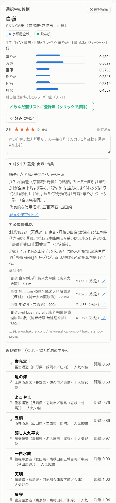

# 使い方

日本酒フレーバーマップの操作説明です。

## 目次

- [開き方](#開き方)
- [画面の構成](#画面の構成)
- [1. 地域から探す](#1-地域から探す)
- [2. 銘柄を選ぶ](#2-銘柄を選ぶ)
- [3. 味が近い銘柄を探す](#3-味が近い銘柄を探す)
- [4. 飲んだ酒を記録する](#4-飲んだ酒を記録する)
- [5. 好みの中心から探す](#5-好みの中心から探す)
- [6. メモと★評価](#6-メモと評価)
- [7. 表示の切り替え](#7-表示の切り替え)
- [8. データの保存とバックアップ](#8-データの保存とバックアップ)
- [困ったときは](#困ったときは)

---

## 開き方

次のどちらでも動きます。インストールもサーバーも不要です。

- **Web で開く** … https://latterl.github.io/sake-flavor-map/
- **ファイルで開く** … `sake_map.html` をダウンロードしてダブルクリック

どちらも同じアプリですが、**記録の保存先はブラウザごとに分かれます**。Web 版で登録した飲んだ酒は、ファイル版には引き継がれません（[8. データの保存とバックアップ](#8-データの保存とバックアップ)で移せます）。

ネットワークに繋がっていなくても動作します。

## 画面の構成

| 領域 | 内容 |
|---|---|
| **上部バー** | データ切替・マップ切替・色分け・好み表示・地域選択・タグ絞り込み・銘柄検索・表表示 |
| **マップ（左）** | 点＝1銘柄、近い点＝味が似ている銘柄。クリック／タップで選択、マウスホイールまたは2本指ピンチで拡大縮小、ドラッグ／1本指で移動 |
| **サイドパネル（右）** | 選択中の銘柄の詳細・味わい6軸のバー・飲んだ酒／好みボタン・メモと★評価・蔵元情報・商品リスト・近い銘柄10件・地域の銘柄一覧・飲んだ酒／メモあり一覧 |

## 1. 地域から探す

初期状態では地域は選択されていません。上部バーの **「地域ハイライト」** で都道府県を選び、続いて **「県内地域」** を選ぶと、その地域の銘柄が青くハイライトされ、右パネルの一覧に出ます。

- 県内地域は各県の一般的な地方区分（新潟＝上越/中越/下越/佐渡、山形＝村山/最上/置賜/庄内 など）です
- 酒どころとして特に知られる地区（京都＝**伏見**、兵庫＝**灘五郷**、広島＝**西条**、京都＝**丹後**）は独立した地域として定義されています
- 「全域」を選ぶと県内すべてが対象になります

一覧の並び順は「五十音順」のほか、飲んだ酒を登録済みなら **「好みに近い順」「好みから遠い順」** を選べます。

## 2. 銘柄を選ぶ

次の 3 つの方法があります。

- **マップ上の点をクリック**（カーソルを乗せると銘柄名と蔵元がポップアップします）
- **右パネルの地域一覧をクリック**
- **上部の検索ボックスに入力** → 候補から「地図で選択」

選ぶと右パネルに次が表示されます。

- 銘柄名・蔵元・所在地・味タイプ・人気順位
- **味わい6軸のバー**（華やか・芳醇・重厚・穏やか・ドライ・軽快）。中央線が全銘柄の平均で、右に伸びるほどその要素が強いという意味です
- フレーバータグ（バナナ、熱燗 など）
- 蔵元の紹介と公式サイトへのリンク
- **商品リスト**（取得できている銘柄のみ。商品名・スペック・容量・公式価格・出典リンク）

メモ欄の下にある **「味タイプ・蔵元・商品・出典」** は初期状態では折り畳まれています。見出しをクリック／タップすると、上記の詳細情報をまとめて開閉できます。

## 3. 味が近い銘柄を探す

銘柄を選ぶと、右パネル下部に **「近い銘柄」10 件**が距離の小さい順に出ます。

- **距離** = 標準化した味の特徴量空間でのユークリッド距離。小さいほど味の傾向が似ています
- **クリック** … マップ上でオレンジに強調され、味わい6軸が 2 本並びで比較表示されます
- **ダブルクリック** … その銘柄に移動します
- 好みに指定した銘柄には、銘柄名の前に色付きの **♥** が表示されます

探す対象は上部バーの **「類似検索の対象」** で変えられます。

| 選択肢 | 対象 |
|---|---|
| 有名銘柄＋飲んだ酒（既定） | 人気 Top100 と自分が飲んだ酒 |
| 有名銘柄のみ | 人気 Top100 |
| 飲んだ酒のみ | 自分が飲んだ酒 |
| 選択中の地域 | ハイライト中の地域の銘柄 |
| 全銘柄 | 1,354 銘柄すべて |

## 4. 飲んだ酒を記録する

飲んだ銘柄を登録すると、類似検索の対象や「好みの中心」に使えます。

- 銘柄を選んで **「＋ 飲んだ酒リストに追加」** を押す
- または検索結果の **「飲んだに追加」** を押す

登録した銘柄は右パネル下部の **「飲んだ酒」** タブに一覧表示されます。

- 銘柄名をクリックすると、その銘柄を選択できます
- 左側の **♡／♥** で好みを指定・解除できます
- メモがある場合は、内容が 1 行に収まる長さで表示されます
- **名前順／好み優先／評価順** に並べ替えられます
- 右側の **✕** で飲んだ酒リストから削除できます

**「メモあり」** タブへ切り替えると、★評価またはメモを登録した銘柄だけを一覧表示できます。飲んだ酒に登録していない銘柄のメモも対象です。

> **同名銘柄について** … 県をまたいで同じ銘柄名がある場合（道灌＝兵庫/滋賀、白龍＝新潟/福井、高砂＝三重/静岡、千代鶴＝富山/東京、WAKAZE）は、**別の銘柄として区別**されます。一覧には蔵元名と都道府県・所在地が表示されます。

## 5. 好みの中心から探す

好みに指定した銘柄の平均から「自分の好みの位置」を求め、そこに近い**まだ飲んでいない**銘柄を探す機能です。好みを指定していない場合は、飲んだ酒全体を使います。

1. 銘柄を飲んだ酒リストに追加する
2. 飲んだ酒一覧の **♡**、または選択中の銘柄にある **「♡ 好みに指定」** を押して **♥（好み）** にする
3. **「♥ 好みの中心で探す」** を押す

♥を付けた銘柄があれば、その銘柄群の標準化した味特徴の平均を「好みの中心」として使います。♥がなければ、飲んだ酒すべての平均を使います。中心に近い未飲の銘柄は、2次元マップ座標ではなく射影前の味特徴空間で計算されます。

味マップ上には参考位置として **♥マーカー**が表示されます。これは構成銘柄の2次元表示位置の平均です。また、上部の **「好み ♥を表示」** で、好みに指定した各銘柄のリング表示を切り替えられます。

### 未踏度で眺める

上部バーの **「色分け」→「未踏度」** にすると、各銘柄の「飲んだ酒からの最短距離」が青の濃淡で表示されます。色が濃いところが**まだ味わったことのない領域**です。味タイプ別の未体験ゾーンのランキングと代表銘柄も提案されます。

## 6. メモと★評価

銘柄を選ぶと「飲んだ酒リストに追加」ボタンの下に **メモ欄**があります。

- **★1〜5** … クリックで評価。同じ星をもう一度押すと解除されます
- **テキスト欄** … 味の印象、飲んだ場所、入手先など自由に。**入力すると自動保存**されます（右上に「保存しました」と出ます）
- 全 1,354 銘柄に書けます。飲んだ酒に登録していなくても構いません（「気になる」「見かけたら買う」といったメモにも使えます）

書いたメモは、**マップ上の点にカーソルを乗せたときのポップアップ**にも★と冒頭 44 文字が表示されます。

右パネル下部の **「メモあり」** タブでは、★評価またはメモがある銘柄をまとめて確認できます。飲んだ酒一覧ではメモ本文も1行のプレビューで表示されます。



## 7. 表示の切り替え

| 項目 | 内容 |
|---|---|
| **データ** | さけのわ（銘柄単位・味わい6軸）／ スペックデータ（商品単位・5軸）を切り替え |
| **表示形式** | 味マップ（UMAP）／ 日本地図（蔵元の所在地にプロット） |
| **色分け** | 標準（地域・有名・飲んだ）／ 味タイプ（7分類）／ 未踏度 |
| **好み ♥を表示** | 好みに指定した銘柄のリングをマップ上に表示／非表示 |
| **タグ絞り込み** | 「バナナ」「熱燗」などのタグで最大 3 個の AND 絞り込み |
| **表で見る／表を閉じる** | 数値を表形式で開閉。銘柄選択中は選択銘柄と近い10件、地域選択中はその地域、どちらも未選択なら全銘柄を表示（一覧は最大200件） |
| **🌓 表示切替** | ライト／ダークモード |
| **表示リセット** | マップの拡大・移動を元に戻す |

## 8. データの保存とバックアップ

飲んだ酒リスト・好み・メモは、**使っているブラウザに自動保存**されます。同じブラウザで開き直せば残っています。

ただし次の場合は消えるので、バックアップを取ってください。

- ブラウザの閲覧データ（サイトデータ）を削除したとき
- プライベートウィンドウで使ったとき
- 別の PC・別のブラウザで開いたとき

### バックアップの取り方

右パネル下部の **「💾 ファイルに保存（メモ込み）」** を押すと、`nonda_sake_YYYYMMDD.json` がダウンロードされます。飲んだ酒・好み・メモ・★評価がすべて入っています。

### 復元・移行

**「📂 ファイルから読み込む」** で、保存した JSON を読み込みます。別の PC やブラウザへの移行もこれで行います。

コピー＆ペーストで済ませたい場合は「テキストで書き出し / 読み込み」欄も使えます。

### 保存されるファイルの形式

```json
{
  "app": "sake-flavor-map",
  "saved": "2026-08-20T10:00:00.000Z",
  "count": 3,
  "noteCount": 2,
  "drunk": [{ "pref": "佐賀県", "brand": "七田" }],
  "favs": [{ "pref": "佐賀県", "brand": "七田" }],
  "notes": [
    { "pref": "佐賀県", "brand": "七田", "rating": 3,
      "text": "雄町50が好み。冷やで。", "updated": "2026-08-20T10:00:00.000Z" }
  ]
}
```

古い形式（銘柄名だけの配列や、1 行 1 銘柄のテキスト）も読み込めます。その場合、同名銘柄は両方の県に登録されます。

## 困ったときは

- **メモや飲んだ酒が消えた**  
  ブラウザの閲覧データを消すと消えます。事前に「ファイルに保存」でバックアップを取ってください。プライベートウィンドウでは自動保存が働きません。

- **マップに載っていない銘柄がある**  
  さけのわのフレーバーデータがある 1,354 銘柄のみを表示しています。データのない銘柄（全 3,267 銘柄中 1,913）は載りません。

- **商品リストが出ない銘柄がある**  
  蔵元公式サイトに商品情報が掲載されていない、サイトが存在しない、といった理由で未取得の蔵が 121 あります。

- **価格が実際と違う**  
  2026 年 8 月時点で公式サイトに掲載されていた値です。購入時は商品行の右端のリンクから公式情報をご確認ください。

- **地図表示で点が出ない**  
  蔵元の所在地が特定できていない 5 銘柄（海外醸造・共同プロジェクト等）は日本地図に表示されません。味マップには載っています。

- **動作が重い**  
  全銘柄表示＋未踏度の色分けは計算量が多くなります。地域や類似検索の対象を絞ると軽くなります。

- **同じ銘柄が地図に2つある（岐阜県「初緑」）**  
  さけのわの蔵元マスタに高木酒造と奥飛騨酒造の2レコードとして重複登録されているためです（同じ蔵の改称前後と思われます）。上流データに忠実であることを優先して統合していません。
